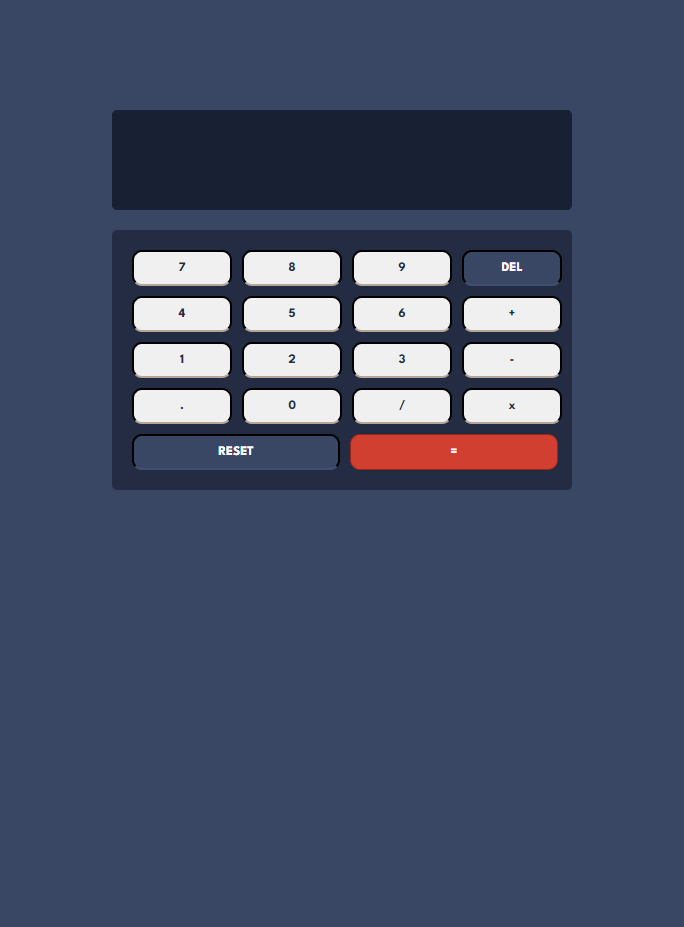

## Olá, obrigado por pela visita! 👋

Seja muito bem-vindo, e obrigado por verificar o meu projeto!

## Calculadora simples

Neste desafio, elaborei uma calculadora bem simples com as operações mais comuns. Também adicionei botões para limpar o display, backspace e uma interação bem legal com o teclado.

## Linguagens utilizadas

Neste projeto foram utilizadas as linguagens de:

• HTML;  
• CSS; 
• JavaScript;

## O que aprendi desenvolvendo este projeto

Durante a execução deste projeto, aprendi bastante a respeito de funções no JavaScript, e a utilizar interações com mouse e teclado.
Este foi o meu primeiro projeto utilizando interações, e estou muito satisfeito com o resultado.

## Contato

Você pode se contatar comigo através de email ou diretamente pelo linkedin!

•Email: engenheiro.viniciusp@gmail.com 
•Linkedin:https://www.linkedin.com/in/viniciuspereiraalves